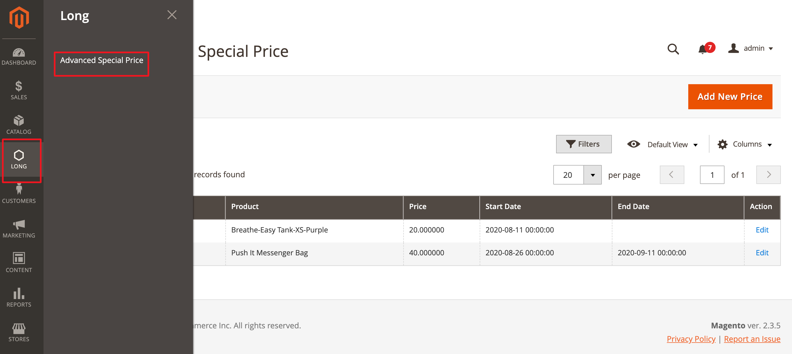
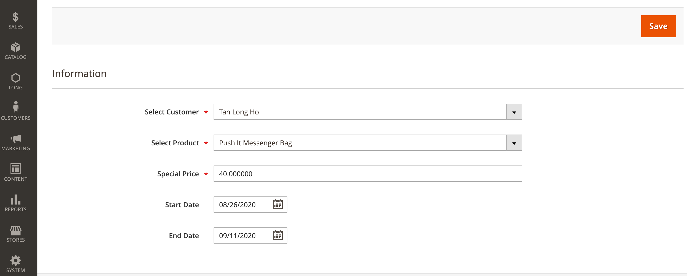
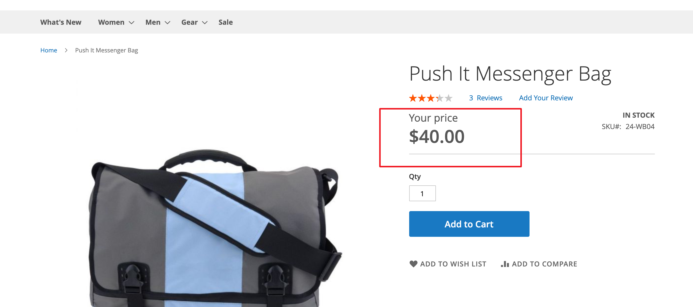

# Mage2 Module Long SpecialPrice

    ``long/module-specialprice``

 - [Main Functionalities](#markdown-header-main-functionalities)
 - [Installation](#markdown-header-installation)
 - [Configuration](#markdown-header-configuration)
 - [Specifications](#markdown-header-specifications)
 - [Attributes](#markdown-header-attributes)

## Requirements

Needs to create a module which does the following:
1. Add a new page to admin panel with grid and form where admin can specify special price for special customer.
2. Also, admin can specify Start Date and End Date for that price.
3. On the frontend area for customer who has special price should be displayed price from this grid + label near price “Your price”
It should be custom logic (not catalog or sales price rules, not default special price etc)

## Note
This work only for simple product

## Installation
\* = in production please use the `--keep-generated` option

### Type 1: Zip file

 - Unzip the zip file in `app/code`
 - Enable the module by running `php bin/magento module:enable Long_SpecialPrice`
 - Apply database updates by running `php bin/magento setup:upgrade`\*
 - Flush the cache by running `php bin/magento cache:flush`

## Configuration

